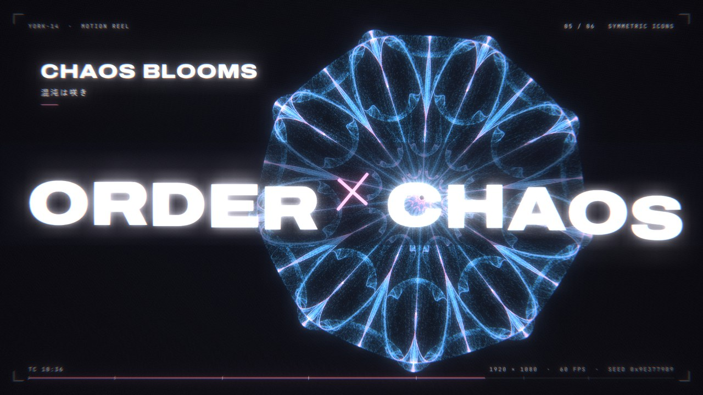

# Design-portfolio

ジェネラティブ・アートとモーションデザインのポートフォリオです。

## ORDER × CHAOS — Generative Motion Reel

これまでの作品の数式をひとつの流れに編み直した、15 秒のモーションリールです。

### ▶ 作品を見る

**https://york-14.github.io/Design-portfolio/**

ブラウザで開くと、その場で全フレームを生成しながら再生します（音声つき、PC・スマートフォン対応）。

- 動画ファイル（MP4）: https://york-14.github.io/Design-portfolio/reel/order-x-chaos-reel.mp4
- リポジトリ内: [`reel/order-x-chaos-reel.mp4`](reel/order-x-chaos-reel.mp4)

[](https://york-14.github.io/Design-portfolio/)

| 仕様 | |
|---|---|
| 長さ | 15 秒 |
| 解像度 / フレームレート | 1920 × 1080 / 60 fps |
| 映像 | H.264 |
| 音声 | AAC 48 kHz、−14 LUFS（Web Audio で合成） |
| 素材 | なし（映像・音声とも、すべてコードで生成） |

## 構成

「ひとつの種から秩序が育ち、ゆらいで混沌へ向かい、咲いて、かたちになる」という流れを 6 つの章で描きます。各章は過去の作品に対応しています。

| 秒 | 章 | 内容 | 元になった作品 |
|---|---|---|---|
| 0–2 | ONE SEED | 光の点が鼓動に合わせて灯る。シード値 `0x9E3779B9`（⌊2³² / φ⌋） | — |
| 2–4.5 | GOLDEN ANGLE | 黄金角 137.507764° による葉序が育ち、ロジスティック写像のゆらぎを受けて一直線に収束する | [Golden-angle-new](https://github.com/York-14/Golden-angle-new) / [golden-angle-drift](https://github.com/York-14/golden-angle-drift) |
| 4.5–6.5 | LOGISTIC MAP | 前の章の直線が、そのまま分岐図の r 軸になる。周期倍分岐をたどり、ファイゲンバウム点 r∞ = 3.5699… へズーム | golden-angle-drift / [Generative-Flower](https://github.com/York-14/Generative-Flower) |
| 6.5–9 | DOUBLE PENDULUM | 初期角度が 10⁻⁸ rad だけ違う 2 本の振り子を RK4 で積分。重なった白い軌跡が 8.6 秒でピンクと青に裂ける | [Double-pendulum](https://github.com/York-14/Double-pendulum) |
| 9–11.5 | SYMMETRIC ICONS | 対称カオス写像を D₅ → D₂₃ → D₉ と探索し、主題「ORDER × CHAOS」を提示。花びらが散る | [Generative-flower-Order-Chaos](https://github.com/York-14/Generative-flower-Order-Chaos) / Generative-Flower |
| 11.5–13 | GENERATIVE VASE | 散った 6000 枚の花びらが、花瓶の曲面式 r(θ, z) の上に集まる | Bamboo |
| 13–15 | END | 377 粒（フィボナッチ数）の葉序マークと名前 | — |

## しくみ

- **すべてのフレームは時刻 t の関数です。** 逐次的な状態を持たないため、どの瞬間にシークしても同じ絵が再現されます。二重振り子の軌道と対称カオス写像の軌道は、起動時に一度だけ計算して使います。
- **数値は実際の計算結果です。** 画面に出る振り子の発散距離 |Δ|、分岐図の周期、写像のパラメータ（λ, α, β, γ, ω, n）は、その場の計算値をそのまま表示しています。
- **色** は過去作と同じく、黒地に淡いブルー（秩序）と淡いピンク（カオス）の 2 色軸で、加算合成で重ねています。
- **ポストエフェクト**（ブルーム、色収差、ズームブラー、グリッチ、フィルムグレイン）は WebGL2 のシェーダで処理し、ビートに合わせた衝撃のタイミングで強さを変えています。
- **サウンド** も Web Audio（OfflineAudioContext）で同じタイムラインから合成しています。ロジスティック写像の章では写像の値をそのまま音程にしているので、1 音 → 2 音 → 4 音 → カオスと、周期倍分岐が耳でも聞こえます。

## ファイル

| ファイル | 内容 |
|---|---|
| `index.html` | トップページ（`reel/` へ転送） |
| `reel/index.html` | リール本体（描画・シェーダ・サウンド・プレイヤーをすべて含む単一ファイル、外部ライブラリなし） |
| `reel/order-x-chaos-reel.mp4` | 書き出した動画 |
| `reel/poster.jpg` | サムネイル（OGP 画像にも使用） |
| `reel/contact-sheet.jpg` | 各章のコンタクトシート |
| `reel/tools/render.mjs` | ヘッドレス Chromium で全フレームを描画し、ffmpeg で MP4 に書き出すスクリプト |
| `.nojekyll` | GitHub Pages でファイルをそのまま配信するための設定 |

名前の表記は `reel/index.html` の `NAME` 定数で変えられます。

## 動画の書き出し

Node.js、Playwright（Chromium）、ffmpeg が必要です。

```bash
node reel/tools/render.mjs                      # reel/out/ に MP4 を書き出す（全 900 フレーム）
node reel/tools/render.mjs --stills 2.6,10.6    # 指定した秒の静止画だけを書き出す
```

## GitHub Pages の設定（初回のみ）

上の URL で表示されないときは、Pages を有効にしてください。GitHub アプリにはこの設定がないため、ブラウザで行います。

1. ブラウザで https://github.com/York-14/Design-portfolio/settings/pages を開く
2. **Source** を「Deploy from a branch」にする
3. **Branch** を `main`、フォルダを `/ (root)` にして **Save**
4. 1〜2 分後に https://york-14.github.io/Design-portfolio/ で表示されます

ローカルで見るときは、`reel/index.html` をブラウザで開くだけで動きます。
